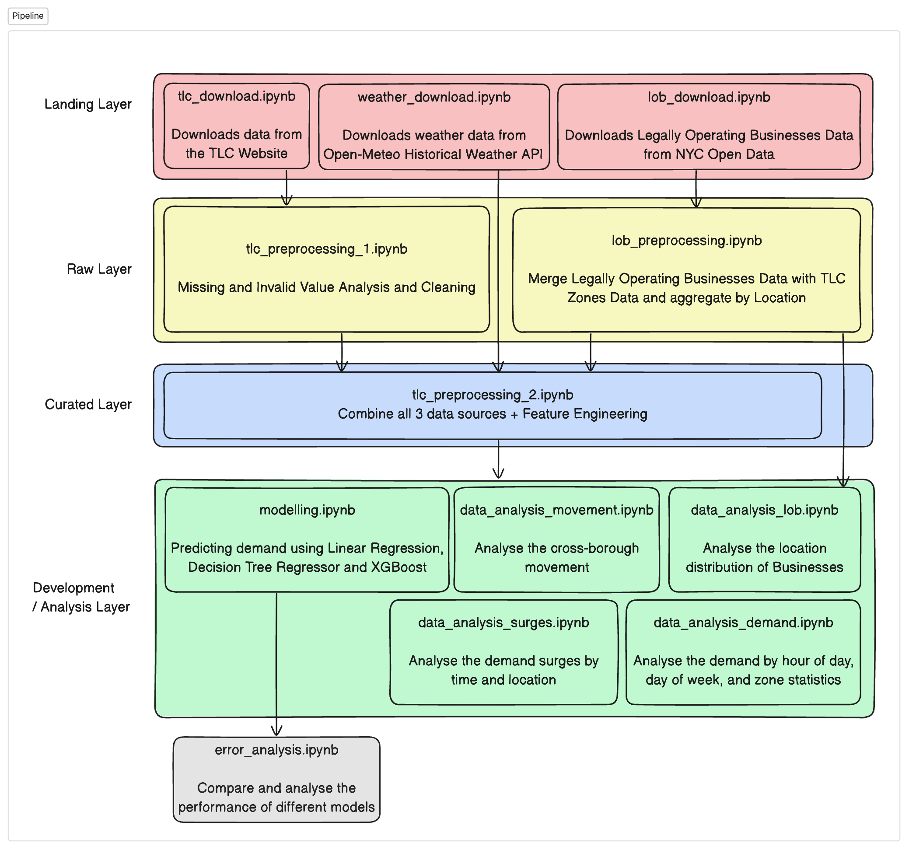

# MAST30034 Project 1 README.md
- Name: `Daksh Agrawal`
- Student ID: `1340113`

**Research Goal:** My research goal is tip analysis for credit card payments

**Timeline:** The timeline for the research area is January 2023 - June 2023.

Here is a brief overview of the pipeline:

To run the pipeline, please visit the `notebooks` directory and run the files in top-down order. The files on the same level can be run in any order.
1. `download.py`: This downloads the raw data into the `data/landing` directory.
2. `preprocess.ipynb`: This notebook details all preprocessing steps and outputs it to the `data/raw` and `data/curated` directory.
3. `analysis.ipynb`: This notebook is used to conduct analysis on the curated data.
4. `model.py` and `model_analysis.ipynb`: The script is used to run the model from CLI and the notebook is used for analysing and discussing the model.
